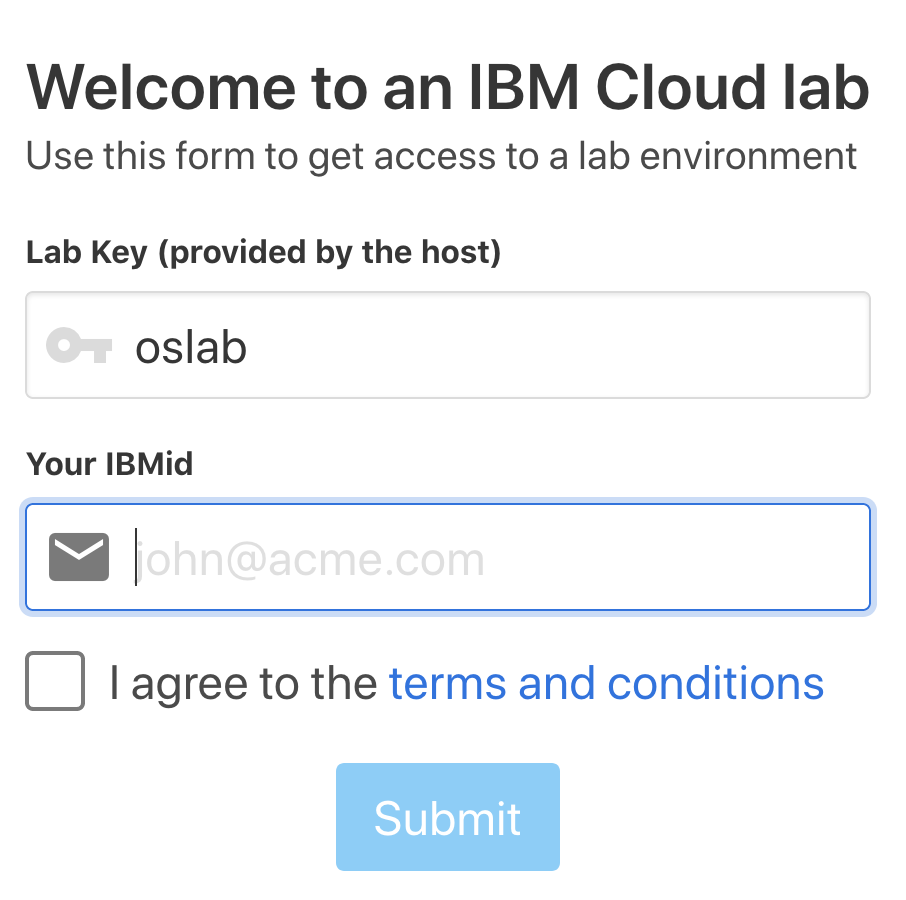

# 1. Register to IBM Cloud 

[Register IBM Cloud](https://ibm.biz/Bdz5wv)

# 2 Get access to IBM Kubernetes Cluster
[access to IBM Kubernetes  Cluster](ynet.co.il)

Use :  
     Lab Key : `oslab`
 
  IBMid : `your emailRegister to IBM Cloud`    

### [Continue to Exercise 1 - Clone the lab repo and create Tone Analyzer service](../exercise-1/README.md)
