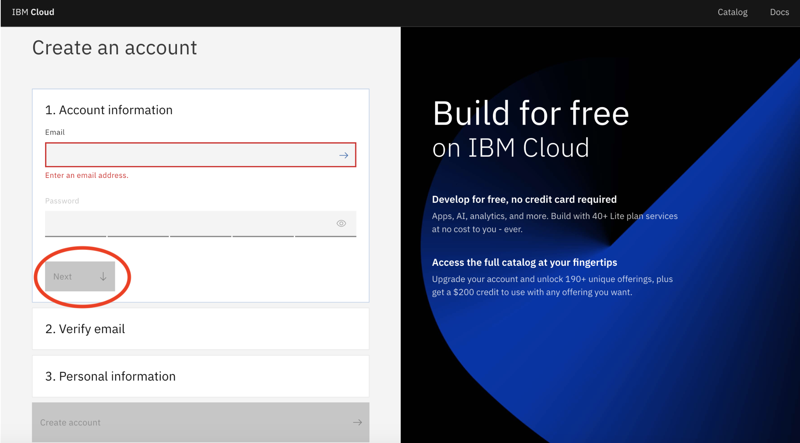
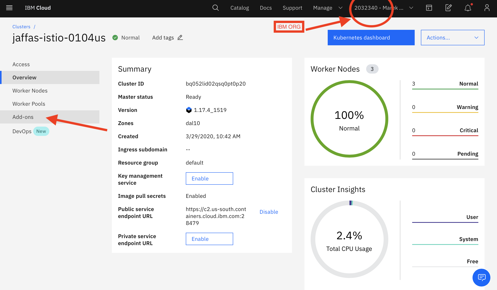

# Step 1 - sign up on IBM Cloud

Sign up for IBM Cloud or log in here [Register IBM Cloud]https://ibm.biz/BdqZqf​

Please fill out the signup form with an email and a password that you want to choose for your IBM Cloud account . 
Then Click Next 

# Step 2 - Verify your email

You will get a verification code to your email, copy it and paste it to the verafication code field then click next .

# Step 3 - Enter your Personal Information

‌Enter your personal information , First and Last name and Country or Region , then Click Next .

# Step 4 - Click Create Account 

# Step 5 - Proceed to your account 

scroll down  and click proceed . 

Congratulations! You just signed up for IBM Cloud account. 

# Step 6 - Get access to IBM Kubernetes Cluster
[access to IBM Kubernetes  Cluster](https://ikskubeweb.mybluemix.net/)

Use :  
     Lab Key : `ikslab`
 
  IBMid : `your emailRegister to IBM Cloud`    

After you hit submit, you will be given a cluster for the duration of the workshop.
You should be given the result page showing the successful assignment.

# Step 7 - Install Istio Add-on 

When you sign up / log in to IBM Cloud, from the Dashboard you need to navigate to
# !!!! IBM Org

After you enter your Kubernetes Dashboard click Add-ons ( in the left) 

Install the Managed Istio and the Kuberntes Terminal (this will take a few minutes ) 

### [Continue to Exercise 1 - Clone the lab repo and create Tone Analyzer service](../exercise-1/README.md)
