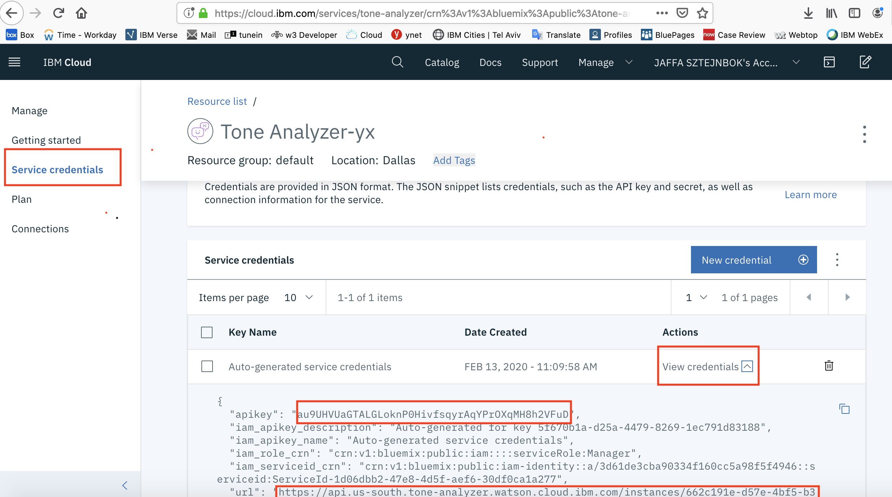
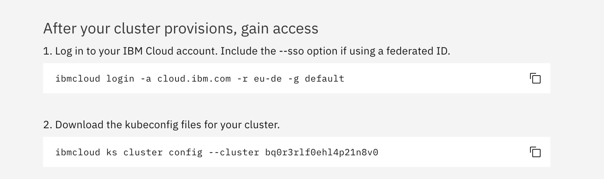

# Exercise 1 - Clone the lab repo and create Tone Analyzer service 

You must already have a [cluster created](https://cloud.ibm.com/docs/containers?topic=containers-clusters#clusters_standard). Your cluster must have **3 or more worker nodes** with at least **4 cores and 16GB RAM**, and run Kubernetes version 1.16 or later.
Also **Istio** is alreay installed and enabled 

### Use Watson Tone Analyzer
Watson Tone Analyzer detects the tone from the words that users enter into the Guestbook app. The tone is converted to the corresponding emoticons.


1. Create an instance of the Tone Analyzer service and get your credentials:
    - Go to the [Tone Analyzer](https://cloud.ibm.com/catalog/services/tone-analyzer) page in the IBM Cloud Catalog.
    - Log in to your IBM Cloud account.
    -  **-  MAKE SURE you are using your account and not the IBM Account!!!!!!!!!**
  
    - Click **Create**.
    - Click **Service Credenrials** and then click  **View Credenrials** to view the service credentials.
    - Copy the `apikey` value and  the `url` values and save it for later !!!!
    
    

## Clone the lab repo

1. Go back to the **IBM Account Org** and find again your cluster , click on your cluster 

2. From the cluster screen click on `Access` (on the left side of the screen) you will need this for the next step to gain acces to your cluster.
3. We will use cloudhsell (cmd already ready for you with everything already pre-installed for you). To use cloudshell go to  [cloudshell link ](https://shell.cloud.ibm.com/)
4. In the cloudshell copy and run steps 1 an 2 only from **YOUR**  `Access` screen .now you are ready to use the cloudhsell 
 

5. From your command line, run:

    ```shell
    git clone https://github.com/IBM/istio101

    cd istio101/workshop
    ```

    This is the working directory for the workshop. You will use the example `.yaml` files that are located in the `workshop/plans` directory in the following exercises.

### [Continue to Exercise 2 - Installing Istio](../exercise-2/README.md)
